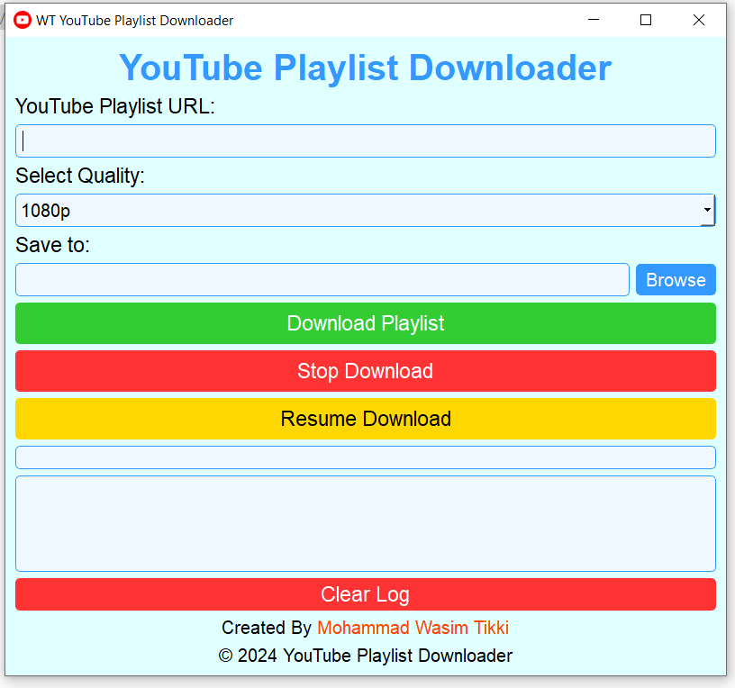
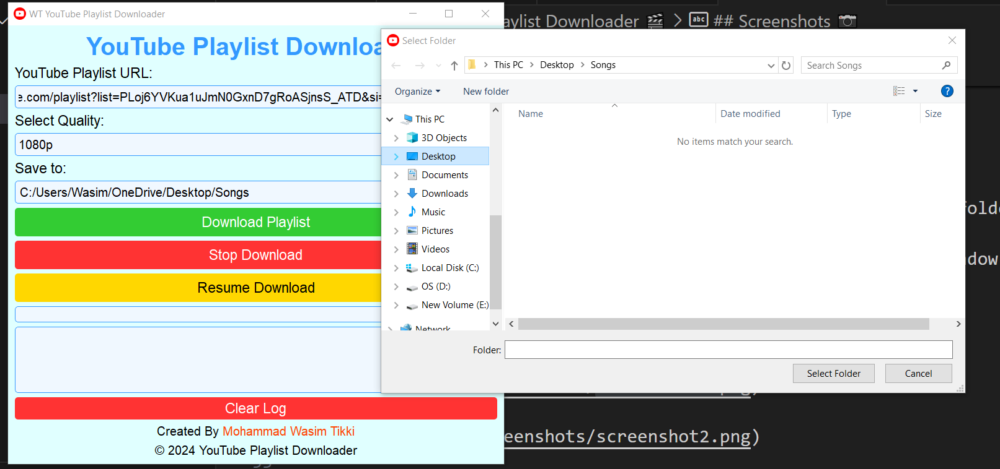
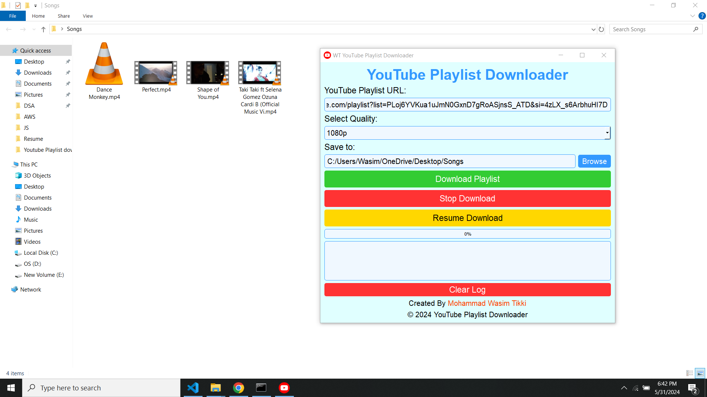

# YouTube Playlist Downloader 🎬

YouTube Playlist Downloader is a simple PyQt5 application that allows users to download entire YouTube playlists with ease.

## Features 🚀

- Download entire YouTube playlists by providing the playlist URL.
- Choose the desired video quality (1080p, 720p, 480p, 360p, 240p).
- Select the destination folder to save the downloaded videos.
- Real-time progress bar to track the download progress.
- Log window to display detailed download information.
- User-friendly interface.

## Requirements 📋

- Python 3.x
- PyQt5
- pytube

## Installation 💻

1. Clone the repository:

    ```
    git clone https://github.com/wasimtikki120/WT-Youtube-Playlist-Downloader.git
    ```

2. Install the required dependencies:

    ```
    pip install PyQt5 pytube
    ```

## Usage 📦

1. Run the application:

    ```
    python main.py
    ```

2. Enter the YouTube playlist URL.
3. Choose the desired video quality and select the destination folder.
4. Click on the "Download Playlist" button to start downloading.
5. Monitor the progress in the progress bar and detailed log window.
6. Once the download is complete, a notification will be shown.

## Screenshots 📷







## License 📄

This project is licensed under the [MIT License](LICENSE).

## Credits 🙌

- Mohammad Wasim Tikki - [GitHub](https://github.com/wasimtikki120)

## Feedback 📧

If you have any suggestions, feature requests, or bug reports, feel free to open an issue or contact [me](https://github.com/wasimtikki120).

## License 📄

This project is licensed under the [MIT License](License.md).

